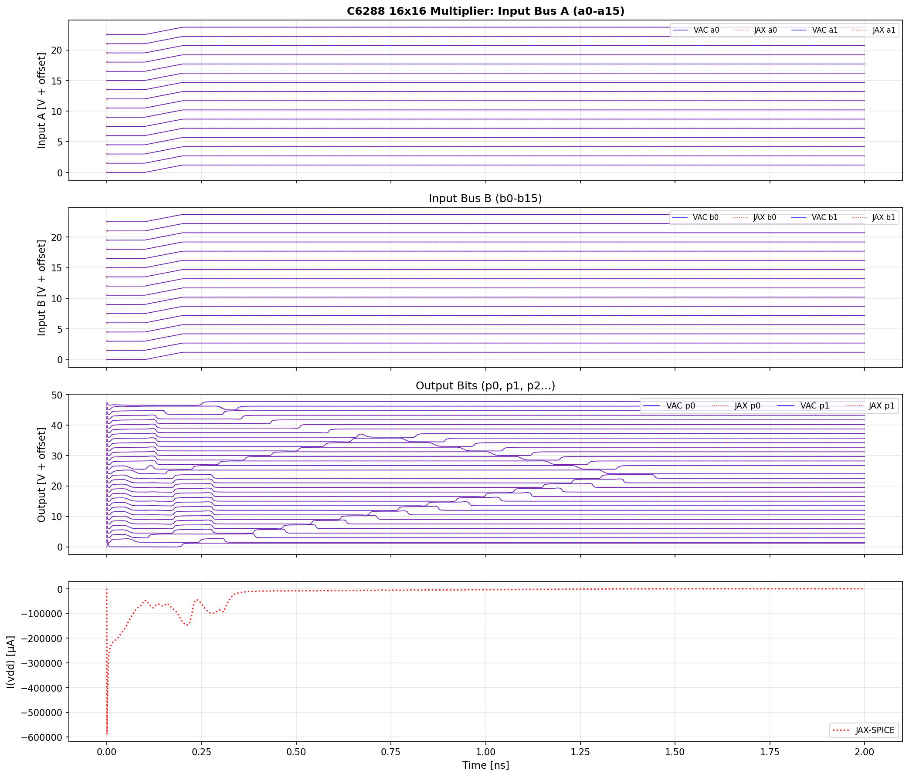

# VAJAX: GPU-Accelerated Analog Circuit Simulator

A proof-of-concept GPU-accelerated analog circuit simulator built on JAX, demonstrating:

- **Automatic differentiation** for computing device Jacobians without explicit derivatives
- **GPU acceleration** for large circuits using JAX's JIT compilation
- **Verilog-A model integration** via OpenVAF/OSDI bindings for PDK compatibility
- **SAX-inspired functional device model API**

## Current Status

VAJAX is in active development as a proof-of-concept. All VACASK benchmark circuits are passing.

**[CI test results and benchmarks](ci-status.md)**

## Validation: Three-Way Comparison

VAJAX results are validated against VACASK (reference simulator) and ngspice.
All simulators use identical netlists and device models (PSP103 MOSFETs via OSDI).

### RC Low-Pass Filter

Simple RC circuit demonstrating basic transient behavior. VAJAX matches VACASK and ngspice exactly.


### PSP103 Ring Oscillator

7-stage ring oscillator with production PSP103 MOSFET models. Shows excellent agreement in oscillation frequency and waveform shape.


### C6288 16-bit Multiplier

Large-scale benchmark with ~86,000 nodes. Uses sparse solver for memory efficiency. Demonstrates VAJAX scaling to production-sized circuits.



## Performance

VAJAX is designed for GPU acceleration of large circuits. The table below shows
per-step timing against VACASK (C++ reference simulator) on CI runners.

### CPU Performance (vs VACASK)

| Benchmark | Nodes | Steps | JAX (ms/step) | VACASK (ms/step) | Ratio | RMS Error |
|-----------|------:|------:|--------------:|-----------------:|------:|-----------|
| rc        |     4 |    1M |         0.012 |            0.002 |  6.6x | 0.00%     |
| graetz    |     6 |    1M |         0.020 |            0.004 |  5.4x | 0.00%     |
| mul       |     8 |  500k |         0.041 |            0.004 | 10.9x | 0.00%     |
| ring      |    47 |   20k |         0.511 |            0.109 |  4.7x | -         |
| c6288     | ~5000 |    1k |        88.060 |           76.390 |  1.2x | 2.01%     |

### GPU Performance

| Benchmark | Nodes | JAX GPU (ms/step) | JAX CPU (ms/step) | GPU Speedup | vs VACASK CPU |
|-----------|------:|-------------------:|-------------------:|------------:|--------------:|
| c6288     | ~5000 |             19.81  |             88.06  |      4.4x   |   **2.9x faster** |
| ring      |    47 |              1.49  |              0.51  |      0.3x   | below threshold |
| rc        |     4 |              0.24  |              0.01  |      0.05x  | below threshold |

See [Performance Analysis](performance_analysis.md) for the full overhead breakdown.

## Quick Start

```bash
# Install with uv (recommended)
uv sync

# Run tests
uv sync --extra test
JAX_PLATFORMS=cpu uv run pytest tests/ -v

# Run a benchmark
JAX_PLATFORMS=cpu uv run vajax benchmark ring
```

### Installation Options

```bash
# CPU only (default)
uv sync

# With CUDA 12 support (Linux)
uv sync --extra cuda12

# With SAX integration
uv sync --extra sax
```

## Architecture Overview

```
vajax/
├── analysis/             # Circuit solvers and analysis engines
│   ├── engine.py        # CircuitEngine - main simulation API
│   ├── solver.py        # Newton-Raphson with lax.while_loop
│   ├── transient/       # Transient analysis (scan/loop strategies)
│   ├── ac.py            # AC small-signal analysis
│   ├── noise.py         # Noise analysis
│   ├── hb.py            # Harmonic balance
│   ├── xfer.py          # Transfer function (DCINC, DCXF, ACXF)
│   ├── corners.py       # PVT corner analysis
│   ├── homotopy.py      # Convergence aids (GMIN, source stepping)
│   └── sparse.py        # JAX sparse matrix operations (BCOO/BCSR)
│
├── devices/              # Device models
│   ├── vsource.py       # Voltage/current source waveforms
│   └── verilog_a.py     # OpenVAF Verilog-A wrapper
│
├── netlist/              # Circuit representation
│   ├── parser.py        # VACASK netlist parser
│   └── circuit.py       # Circuit data structures
│
└── benchmarks/           # Benchmark infrastructure
    ├── registry.py      # Auto-discovery of benchmarks
    └── runner.py        # VACASK benchmark runner
```

See [Architecture Overview](architecture_overview.md) for the full design documentation.

## Documentation

### User Guide

- [API Reference](api_reference.md) - CircuitEngine, result types, I/O
- [CLI Reference](cli_reference.md) - Command-line interface
- [Transient Options](transient_options.md) - Transient analysis configuration
- [Performance Analysis](performance_analysis.md) - Overhead breakdown
- [VACASK Sim Format](vacask_sim_format.md) - Circuit file format

### Developer Guide

- [Architecture Overview](architecture_overview.md) - System design
- [GPU Solver Architecture](gpu_solver_architecture.md) - Solver internals
- [GPU Solver Jacobian](gpu_solver_jacobian.md) - Jacobian computation
- [Debug Tools](debug_tools.md) - Debugging utilities
- [OSDI Inputs](vacask_osdi_inputs.md) - OpenVAF integration
